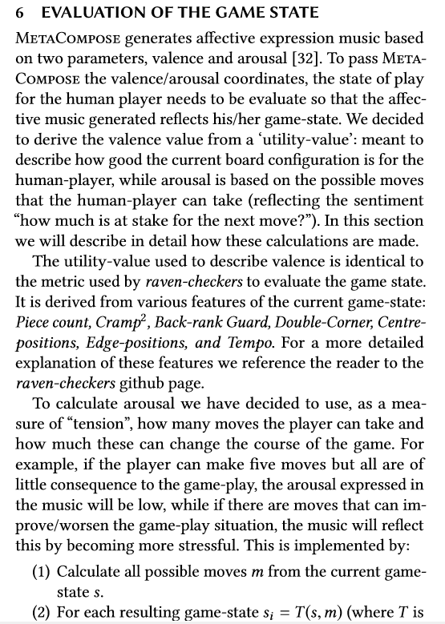
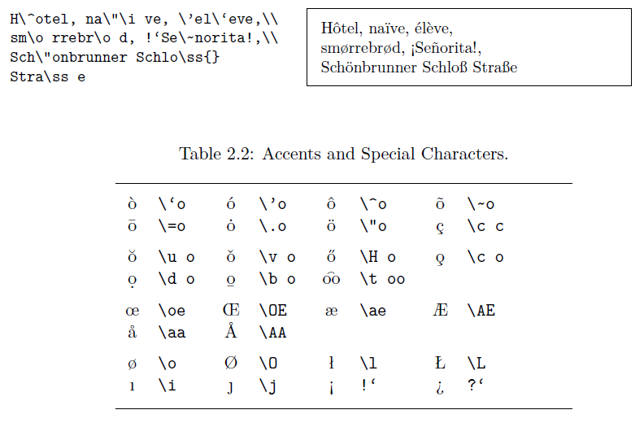
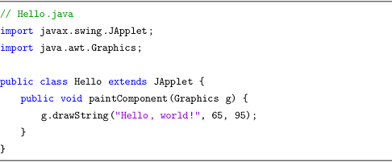
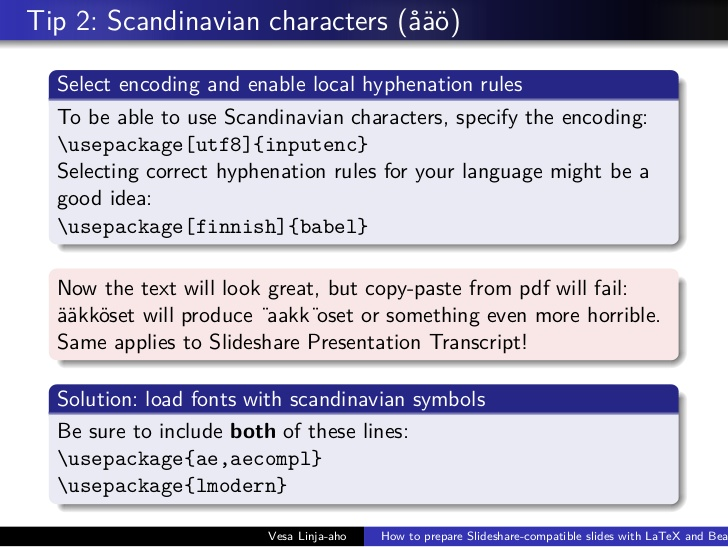

## Academic writing 
## and LaTeX workshop

[Marco Scirea](http://marcoscirea.com)
 
[msc@mmmi.sdu.dk](msc@mmmi.sdu.dk)


<!-- .slide:  data-background-video="http://msci.itu.dk/peace.mp4"-->
## Who am I?
* <!-- .element: class="fragment" -->Assistant Professor at the University of Southern Denmark
* <!-- .element: class="fragment" -->PhD in affective music generation for games
* <!-- .element: class="fragment" -->Studied Game Design at the IT University of Copenhagen
* <!-- .element: class="fragment" -->Like to make weird things, especially if these make other things


<!-- .slide: data-background="Chicken-Attack.gif" -->
## Favourite games<!-- .element: class="onFigure" -->
> * Most LoZ games
* Night in the woods
* The Longest Journey series
* Hat in Time
* Legacy of Kain series
* any Zachtronics game
* the Witcher 3
* a lot more...


### Why is writing important?

As a student you will be required to write various texts: dissertations, papers, reports, essays, etc.<!-- .element: class="fragment" -->

These assignments will be quite different from each other<!-- .element: class="fragment" -->

Sometimes you can just report about your project or personal experience...<!-- .element: class="fragment" -->

... but most times you need to do additional research and use external sources!<!-- .element: class="fragment" -->


<!-- .slide: data-background="https://media.giphy.com/media/XIqCQx02E1U9W/giphy.gif" -->
### <!-- .element: class="onFigure" -->Moreover you (almost always) have a <span style="color:red">deadline</span>! 


### Why are we here?

Knowing how to identify good writing and what techniques that can be used will make you able to write well and in shorter time!<!-- .element: class="fragment" -->

(Good writing is also a skill that transfers into any career field, you will almost always need to write!)<!-- .element: class="fragment" -->

What do you think are the main qualities of a good academic writer?<!-- .element: class="fragment" -->


### Today's menu

* Research
* Problem statement
* Basic structure of academic writing 
* Writing strategies
* Intro to LaTeX
* Appendix
  * A few tips about writing in English
  * Punctuation
---
<small>We will do a few activities, so this won't be a monologue ;)</small>

---

<!-- .slide: data-background="research.jpg" -->
## Research<!-- .element: class="onFigure" -->


### How do we start?

* First, check the scope and subject of the task<!-- .element: class="fragment" -->
* Then<!-- .element: class="fragment" --> we can start looking for <span style="color:red">credible</span> research 
  * Credible: peer reviewed, and published in relevant and established conferences/journals<!-- .element: class="fragment" -->


### Where to find credible sources?

* Textbooks<!-- .element: class="fragment" -->
* Books published by recognized authors and publishers<!-- .element: class="fragment" -->
* Papers in scientific journals/conferences<!-- .element: class="fragment" -->
* References used in papers already established as relevant for your project<!-- .element: class="fragment" -->
* etc.<!-- .element: class="fragment" -->

<!-- .element: class="fragment" -->**Google scholar** is a great place to start searching: [scholar.google.com](scholar.google.com) 


<!-- .slide: data-background="wiki.png" data-background-opacity="0.5" -->
### Is Wikipedia a credible source?<!-- .element: class="onFigure" -->

No, since there is no peer-review to make sure of the validity of the content<!-- .element: class="fragment" -->

But<!-- .element: class="fragment" --> you can use it as a <span style="color:lawngreen">starting point</span> :)


### How do I keep track of what I read?
* Take short notes/summaries<!-- .element: class="fragment" -->
* Maybe even quotes/highlights<!-- .element: class="fragment" -->
* Reference management software can be helpful: for example Zotero, or Mendeley<!-- .element: class="fragment" --> (see a larger list [here](https://en.wikipedia.org/wiki/Comparison_of_reference_management_software))

---

<!-- .slide: data-background="https://media.giphy.com/media/NTur7XlVDUdqM/giphy.gif" -->
## Problem statement<!-- .element: class="onFigure" -->


### Problem Statement

* What is the topic of the paper<!-- .element: class="fragment" -->
* It should show intent <!-- .element: class="fragment" -->
   * _"The way music is handled in video-games does not use the full potential that computers allow us, generative music could create a much better experience"_<!-- .element: class="fragment" -->
* It holds the key objective/thesis of the paper<!-- .element: class="fragment" -->
* If you don't know what your problem statement is, it's going to be very hard to write your paper.<!-- .element: class="fragment" -->


<!-- .slide: data-background="https://media.giphy.com/media/dNgK7Ws7y176U/source.gif" -->
### <!-- .element: class="onFigure" -->*Exercise:* try to write the problem description for your paper, or an interest you might have <!-- .element: class="onFigure" -->


### Problem Statement &rarr; Research question

* With your problem statement done, now you know what your thesis/objective is<!-- .element: class="fragment" -->
* But how do we reach it?<!-- .element: class="fragment" -->
* We need to define some research questions:<!-- .element: class="fragment" -->
    * What questions do we need to answer to be able to explore our problem statement?<!-- .element: class="fragment" -->


### Problem Statement &rarr; Research question

_"The way music is handled in video-games does not use the full potential that computers allow us, generative music could create a much better experience"_

Gives us, for example:<!-- .element: class="fragment" -->

1. <!-- .element: class="fragment" -->_"Can generative music create a better experience?"_
1. <!-- .element: class="fragment" -->_"How can we design generative music systems for games?"_


<!-- .slide: data-background="https://media.giphy.com/media/dNgK7Ws7y176U/source.gif" -->
### <!-- .element: class="onFigure" -->*Exercise:* based on the problem description try to write a research question <!-- .element: class="onFigure" -->

---

## Basic structure of academic writing


1. Introduction
1. Methods/Background Theories
1. Results
1. Discussion
1. Conclusion

<small>Note: the preferred structure might change slightly depending on your field</small><!-- .element: class="fragment" -->


### Introduction

* What problem are you trying to solve? <!-- .element: class="fragment" -->
* Why is this important? <!-- .element: class="fragment" -->
* What do we want to improve?<!-- .element: class="fragment" -->

<!-- .element: class="fragment" -->Going from general to specific: <span class="fragment" style="color:orange">from describing the problem</span> <span class="fragment"  style="color:lawngreen">to proposing the thesis</span>

<!-- .element: class="fragment" -->Introducing your research questions


### Methods/Background Theories
* Has this been done before? <!-- .element: class="fragment" -->
* How? <!-- .element: class="fragment" -->
* If not, what's the closest related research? (Both using similar and different approaches) <!-- .element: class="fragment" -->
* What's novel about your research?<!-- .element: class="fragment" -->
* How do the theories/algorithms you used work? Describe in as much detail as you can fit into the report. <!-- .element: class="fragment" -->


### Methods/Background Theories
* What has been done in this (or related) problem domain <!-- .element: class="fragment" -->
* What theories are going to be relevant either: <!-- .element: class="fragment" -->
    * as knowledge to understand your work, <!-- .element: class="fragment" -->
    * or because you base your work on them <!-- .element: class="fragment" -->
* What methodologies and algorithms you used in your work <!-- .element: class="fragment" -->

<small>Sometimes these can be split in two parts: one for more theoretical frameworks, and one for practical methods</small> <!-- .element: class="fragment" -->


### Results
* Did it work? <!-- .element: class="fragment" -->
* How well? <!-- .element: class="fragment" -->
* Provide figures, tables, graphs, etc. (as needed) <!-- .element: class="fragment" -->

Generally reporting on the data you gathered, WITHOUT making any assumption about what it might mean <!-- .element: class="fragment" -->


### Discussion

This is where you present an analysis of your data and discuss what it might mean, also in relationship to your research questions. <!-- .element: class="fragment" -->

* Does the data support our thesis? <!-- .element: class="fragment" -->
* How well? Are the results significant? <!-- .element: class="fragment" -->


### Conclusions

Finally you wrap up by doing almost the reverse of the introduction: <!-- .element: class="fragment" -->

* Start from the thesis and research questions <!-- .element: class="fragment" -->
* Summarize the results you obtained, and how they relate to the thesis <!-- .element: class="fragment" -->
* Include shortcomings and possible future work <!-- .element: class="fragment" -->
* Conclude what you found out relating to your thesis <!-- .element: class="fragment" -->


### Conclusions
* What are the strengths and shortcomings of your method? <!-- .element: class="fragment" -->
* How well would it generalize? <!-- .element: class="fragment" -->
* How controllable is it? <!-- .element: class="fragment" -->
* How would you develop it further? What would be the next steps to continue this research? <!-- .element: class="fragment" -->


<!-- .slide: data-background="https://media.giphy.com/media/dNgK7Ws7y176U/source.gif" -->
### Exercise: in groups, take a look at your texts and discuss stregths/weaknesses <!-- .element: class="onFigure" -->

---

<!-- .slide: data-background="https://media.giphy.com/media/H9GdRg90WerxC/giphy.gif" -->
## Writing strategies<!-- .element: class="onFigure" -->


## Disclaimer
**There are many ways to write!**<!-- .element: style="color:orange" class="fragment" -->

I'll tell you about things that I think are generally helpful and that work for me<!-- .element: class="fragment" -->


### Getting started
1. Start early, write regularly<!-- .element: class="fragment" -->
1. Draft an outline - make headlines<!-- .element: class="fragment" -->
1. Generate a table of contents  <!-- .element: class="fragment" -->
  * Write your text under each heading<!-- .element: class="fragment" -->
1. Update the table of contents regularly  <!-- .element: class="fragment" -->
  * Helps with keeping track of progress and structure<!-- .element: class="fragment" -->


### Mindset/setup
1. "Shameless writing"<!-- .element: class="fragment" -->
  * Writing is a creative process, it takes time and effort<!-- .element: class="fragment" -->
  * Imagine who you're writing to!<!-- .element: class="fragment" -->
1. Make headlines for each paragraph to keep focus and stringency<!-- .element: class="fragment" -->
  * You can remove them when you're done<!-- .element: class="fragment" -->
1. Write your research question in the header<!-- .element: class="fragment" -->
  * Keep your writing on track<!-- .element: class="fragment" -->


### Actually writing
1. Be critical: "is this really necessary?"<!-- .element: class="fragment" -->
1. Write the "easy" parts first<!-- .element: class="fragment" --><!-- .element: class="fragment" -->
1. Read aloud to check flow and clarity<!-- .element: class="fragment" -->
1. Reward yourself when you achieve your day's target<!-- .element: class="fragment" -->
  * Everybody likes cake at the end of the day :)<!-- .element: class="fragment" -->


## Topic sentences
* Summarizes the main idea of a paragraph<!-- .element: class="fragment" -->
* Generally the first sentence of the paragraph<!-- .element: class="fragment" -->
* Especially useful for long paragraphs<!-- .element: class="fragment" -->
* I find it helpful to start by writing these and then the paragraph content<!-- .element: class="fragment" -->     


## Example: from topic sentences...
```tex
\textsc{MetaCompose} generates affective expression music based on 
two parameters, valence and arousal~\cite{scirea2016metacompose}.

The utility-value used to describe valence is identical to the 
metric used by \textit{raven-checkers} to evaluate the game state.

To calculate arousal we have decided to use, as a measure of 
``tension'', how many moves the player can take and how much 
these can change the course of the game.
```


## <!-- .element: class="onFigure" -->... to paragraphs
<!-- .element: style="width:40%" -->


<!-- .slide: data-background="https://media.giphy.com/media/dNgK7Ws7y176U/source.gif" -->
### <!-- .element: class="onFigure" -->*Exercise:* try to write a couple of paragraphs based on your research question by starting with headlines and expanding them


### Checking your writing
1. Use your network/classmates for peer feedback!<!-- .element: class="fragment" -->
1. If you're writing with someone else, make sure everybody knows the schedule and workload<!-- .element: class="fragment" -->
  + What is required of each person?<!-- .element: class="fragment" -->
  + Deadlines<!-- .element: class="fragment" -->


### Other advice
1. Publishing?<!-- .element: class="fragment" -->
  + Ask your supervisors/teachers, they will help and advise :)<!-- .element: class="fragment" -->
1. Learn from exams and rejections<!-- .element: class="fragment" -->
1. <!-- .element: class="fragment"-->**READ!**<!-- .element: style="color:orange"-->
  * Reading academic papers will help you identify strengths and weaknesses<!-- .element: class="fragment" -->

---

<!-- .slide: data-background="https://cdn.freebiesupply.com/logos/large/2x/latex-logo-png-transparent.png" -->
## Intro to LaTeX


### What is LaTeX?
_A sophisticated document preparation system._<!-- .element: class="fragment" -->  
* Stylistically uniform<!-- .element: class="fragment" -->  
* Bibliography support<!-- .element: class="fragment" -->  
* Sophisticated structuring abilities<!-- .element: class="fragment" -->  
* Reference tracking<!-- .element: class="fragment" -->  
* Extendable!<!-- .element: class="fragment" -->  
* Looks great!!<!-- .element: class="fragment" -->  


### What can't LaTeX do?
* Spell check<!-- .element: class="fragment" -->  
* 100% control over the formatting <!-- .element: class="fragment" -->  
  * Latex knows best, *most of the time*<!-- .element: class="fragment" -->  
* Provide a graphical interface<!-- .element: class="fragment" -->  
  * Worry not, there are plenty of editors that support Latex<!-- .element: class="fragment" -->  


<!-- .slide: data-background="overleaf.jpg" -->
###  


<!-- .slide: data-background="https://media.giphy.com/media/CQDF0q4pffDW0/giphy.gif" data-background-size="contain"-->
### Why LaTeX?<!-- .element: class="onFigure" -->


### Why LaTeX?
**You shouldn't waste time formatting your document!**<!-- .element: class="fragment" -->  

Things you can say goodbye to:<!-- .element: class="fragment" -->  
* Worrying about font size of text, headers, etc.<!-- .element: class="fragment" -->  
* Changing every instance of some formatting because you decided you wanted something different<!-- .element: class="fragment" -->  
* Updating your bibliography by hand<!-- .element: class="fragment" -->  
* Figure out how to add properly formatted mathematical formulas<!-- .element: class="fragment" -->  


### Basic Latex document
* Specify type of document class<!-- .element: class="fragment" -->  

   <small>book, report, article, letter, beamer (for presentations), etc.</small><!-- .element: class="fragment" -->  
* Declare where does your text start/end<!-- .element: class="fragment" -->  

   `\begin{document} ... \end{document}`<!-- .element: class="fragment" -->  

```tex
\documentclass{article}
\begin{document}
Hello, \LaTeX!
\end{document}
``` 
<!-- .element: class="fragment" -->


### Declarations and Environments
There are 2 main types of commands you can give:

* <!-- .element: class="fragment" style="color:cyan"-->Declarations 
  * stated once
  * always in effect until overwritten
  * (can often be constrained)
  * e.g. `\documentclass`, `\small`
* <!-- .element: class="fragment" style="color:gold"--> Environments
  * are contained between begin and end commands
  * e.g. `\begin{document} ... \end{document}`


### Arguments
* Required arguments are in curly brackets<!-- .element: class="fragment" --> 
  `\documentclass{article}`
* Some commands have optional arguments as well, these are included in square brackets<!-- .element: class="fragment" --> 
  `\documentclass[12pt]{article}`


### Special characters
<small>Any non-standard character (or characters that are special in Latex) is represented with a special command</small>




### Packages
There are many packages (libraries) that can allow you to customize LaTeX<!-- .element: class="fragment" --> 

You<!-- .element: class="fragment" --> can import them using `\usepackage{name}` 

Very useful packages:<!-- .element: class="fragment" --> 

   graphicx, epsg, geometry, fancyhdr, setspace, amsmath, listings, xcolor, url<!-- .element: class="fragment" --> 


### Font types
There are many ways to specify how the text is going to look and how big it will be:
* _italic_: \emph{text}
* **bold**: \textbf{text}
* small: {\small text}
* large: {\large text}
* etc...


### Lists
* Bullet list
```tex
\begin{itemize}
\item Text
\item Text
\end{itemize}
```
* Numbered lists
```tex
\begin{enumerate}
\item Text
\item Text
\end{enumerate}
```


### Structuring your document
* You can define an abstract<!-- .element: class="fragment" --> 
```tex
\begin{abstract} ... \end{abstract}
```
* You can create sections<!-- .element: class="fragment" -->
```tex
\section{Introduction}
```
* And subsections!<!-- .element: class="fragment" -->
```tex
\subsection{Important bit}
\subsubsection{Less important bit}
\subsubsubsection{Even less important bit}
```


### Internal referencing!
You can add a label to any (sub)section so it can be referred to from the text
```tex
\section{Results}\label{results}
...
As seen in Section \ref{results} 
...
```
Footnotes are easy as well!
```tex
... we used the totally-not-made-up 
library \footnote{totally-real-url} ...
```


### References in Latex

```tex
\begin{thebibliography}{9}

\bibitem{lamport94}
  Leslie Lamport,
  \textit{\LaTeX: a document preparation system},
  Addison Wesley, Massachusetts,
  2nd edition,
  1994.

\end{thebibliography}
```


### Bibtex
I<!-- .element: class="fragment" -->  recommend **not** using the basic citation method, but using Bibtex (usually supported by most editors)

In<!-- .element: class="fragment" --> Bibtex you write the entries in a `.bib` file, instead than in the tex file, they look like this:
```tex
@article{greenwade93,
    author  = "George D. Greenwade",
    title   = "The {C}omprehensive {T}ex {A}rchive {N}etwork ({CTAN})",
    year    = "1993",
    journal = "TUGBoat",
    volume  = "14",
    number  = "3",
    pages   = "342--351"
}
```
<!-- .element: class="fragment" -->


### Bibtex
You can compile those by hand, but that's very bothersome, most bibliography management softwares have a Bibtex export function :)

<!-- .element: class="fragment" --> [Example on Google Scholar](https://scholar.google.dk/scholar?hl=da&as_sdt=0%2C5&q=marco+scirea&btnG=): press "Cite" &rarr; "Bibtex" &rarr; copy/paste in your .bib file


### Loading your Bibtex file
```tex
\bibliographystyle{plain}
\bibliography{bibfile1,bibfile2,...,bibfilen}
```

You can easily change the style of your bibliography by changing `plain` to: `acm`, `apacite`, `IEEEtran`, etc...

<small>Note: the first time you add the bib file(s) you might have to re-compile your document 2 times before it is properly recognized</small>


### How to cite inside the text?
* We need to refer to our bibliography text
* Then we can use the `\cite` command
```tex
\cite{nameOfEntry}
```

We can also cite more than one entry at once: <!-- .element: class="fragment" data-fragment-index="1" -->
```tex
\cite{nameOfEntry1, nameOfEntry2}
```
<!-- .element: class="fragment" data-fragment-index="1" -->

You can also do more specific citing<!-- .element: class="fragment" data-fragment-index="2" -->
```tex
\cite[p.~215]{nameOfEntry1}
```
<!-- .element: class="fragment" data-fragment-index="2" -->


### Math?
3 main modes:
* Inline math<!-- .element: class="fragment" data-fragment-index="1" -->

   <!-- .element: class="fragment" data-fragment-index="1" -->write the formulas between `$...$`
* Display math mode (not-inline)<!-- .element: class="fragment" data-fragment-index="2" -->

   <!-- .element: class="fragment" data-fragment-index="2" -->between `$$...$$`
* Equations with numbering:<!-- .element: class="fragment" data-fragment-index="3" -->

   `\begin{equation} ... \end{equation}`<!-- .element: class="fragment" data-fragment-index="3" -->


<!--.slide: data-background="https://media.giphy.com/media/9lMoyThpKynde/giphy.gif" data-background-opacity="1" data-background-size="contain"-->
###  


### Math!
* I recommend using an editor to create your equations, like [https://www.codecogs.com/latex/eqneditor.php](https://www.codecogs.com/latex/eqneditor.php)


### Figures and Tables
Very similar

```tex
\usepackage{graphicx}

\begin{document}

\begin{figure}
  \centering
    \includegraphics[width=0.5\textwidth]{name_of_image}
    \caption[Optional, short caption for index]{Main caption}
\end{figure}

\end{document}
```


<!--.slide: data-background="https://media.giphy.com/media/MXWpHJhkIDFU4/giphy.gif"-->
### Tables

<!--(╯°□°)╯︵ ┻━┻-->

```tex
\begin{table}
  \centering
    \begin{tabular}{| l c r |}
    \hline
    1 & 2 & 3 \\
    4 & 5 & 6 \\
    7 & 8 & 9 \\
    \hline
    \end{tabular}
  \caption{A simple table}
\end{table}
```


### Referencing Figures and Tables
You can use labels, just as with sections! You should define them after the caption (or just inside the figure environment)

```tex
\usepackage{graphicx}

\begin{document}

\begin{figure}
  \centering
    \includegraphics[width=0.5\textwidth]{name_of_image}
    \caption[Optional, short caption for index]{Main caption}
    \label{some_label}
\end{figure}

As seem in Figure \ref{some_label} ...

\end{document}
```


### Where does the figure/table end up?
You can use some specifiers after starting figure:
<small>
* h - more or less _here_ (in the text)
* t - _top_ of the page
* b - _bottom_ of the page
* ! - overrides what Latex considers "good" positions

</small>
```tex
\begin{figure}[h!]
  \centering
    \includegraphics[width=0.5\textwidth]{name_of_image}
    \caption[Optional, short caption for index]{Main caption}
    \label{some_label}
\end{figure}
```


### What about code?
Use the [listings](https://www.ctan.org/tex-archive/macros/latex/contrib/listings/) package

```tex
\usepackage{listings}

\begin{lstlisting}
// Hello.java
import javax.swing.JApplet;
import java.awt.Graphics;

public class Hello extends JApplet {
    public void paintComponent(Graphics g) {
        g.drawString("Hello, world!", 65, 95);
    }    
}
\end{lstlisting}
```


### What about code?
Looks like this:



<small>Might require some extra configuration, see [https://stackoverflow.com/questions/3175105/inserting-code-in-this-latex-document-with-indentation#3175141](https://stackoverflow.com/questions/3175105/inserting-code-in-this-latex-document-with-indentation#3175141)</small>


### Hyperlinks
You can use the [hyperref](https://ctan.org/pkg/hyperref) package to insert links in your PDF

```tex
\usepackage{hyperref}
\begin{document}

This is my website link: 
\href{http://www.marcoscirea.com}{Marco's website}.

You can also link to bare URLs without an additional description: 
\url{http://www.marcoscirea.com}

\end{document}
```


### Hyperlinks
Extra stuff: <!-- .element: class="fragment" -->when using the [hyperref](https://ctan.org/pkg/hyperref) package, any `\ref{}` or `\cite{}` command will also be an internal hyperlink to the referred section/figure/table/citation

I like to add this package even if I don't use any specific links just for this feature :)<!-- .element: class="fragment" -->


<!-- .slide: data-background="https://media.giphy.com/media/dNgK7Ws7y176U/source.gif" -->
### <!-- .element: class="onFigure" -->*Exercise:* take the text you wrote before and put it in LaTeX, watch the magic happen!

---

## Finally...


<!-- .slide: data-background="https://media.giphy.com/media/xlTwaFb20TVjW/giphy.gif" -->
<!--You can find these slides at [http://msci.itu.dk/writing/](http://msci.itu.dk/writing/)-->
I will upload the slides on the facebook page

Feel free to share them around as well :)


## PS: Slides in LaTeX



## PS: these slides
These slides are not written in Latex, but in [Markdown](https://github.com/adam-p/markdown-here/wiki/Markdown-Cheatsheet) language, using the [Reveal.js](https://github.com/hakimel/reveal.js/) framework. 

They actually look something like this:
```md
...
## PS: Slides in LaTeX


## PS: these slides
These slides are not written in Latex, but in 
[Markdown](https://github.com/adam-p/markdown-here/wiki/Markdown-Cheatsheet) language, 
using the [Reveal.js](https://github.com/hakimel/reveal.js/) 
framework. 
...
```


## Thank you :)<!-- .element: class="onFigure" -->
<!-- .slide: data-background="https://media0.giphy.com/media/w3J7mstYCISqs/giphy.gif" -->
---
Webpage: [marcoscirea.com](http://marcoscirea.com)

Twitter: [@MarcoScirea](https://twitter.com/MarcoScirea)

---
Please give some feedbaback at [https://padlet.com/marco_prolog/postits](https://padlet.com/marco_prolog/postits)<!-- .element: style="color:orange" -->

---

<!-- .slide: data-background="https://media.giphy.com/media/PRYqiJ9C9mqbe/giphy.gif" data-background-size="contain" -->
## Appendix 1: A few tips about writing in English<!-- .element: class="onFigure" -->
<br>
<br>
<br>
<br>


### Grammar and syntax
Not really discussed now


### Modality
* This is a viable solution
* This may be a viable solution
* This might be a viable solution

<!-- .element: class="fragment" -->Core modal verbs: *can, could, may, might, will, shall, would, should, must*


### Active voice
<!-- generated with https://www.tablesgenerator.com/html_tables-->
<table>
  <tr>
    <th colspan="2">NP</th>
    <th colspan="3">VP</th>
  </tr>
  <tr>
    <td>noun</td>
    <td>relative clause</td>
    <td>verb</td>
    <td>object</td>
    <td>adverbial</td>
  </tr>
  <tr>
    <td>Susan, </td>
    <td>who works at the Institute,</td>
    <td>drafted</td>
    <td>the report</td>
    <td>last month<br></td>
  </tr>
</table>


### Passive voice

<table>
  <tr>
    <th>NP</th>
    <th colspan="3">VP</th>
  </tr>
  <tr>
    <td>definite article + noun</td>
    <td>verb</td>
    <td>adverbial</td>
    <td>prepositional phrase</td>
  </tr>
  <tr>
    <td>The report</td>
    <td>was drafted</td>
    <td>last month</td>
    <td>by Susan, who works at the Institute</td>
  </tr>
</table>


### Connectives

* Used to connect ideas in sentences <!-- .element: class="fragment" -->
* Usually only used once in a sentence <!-- .element: class="fragment" -->
* Can be used at the start of a sentence <!-- .element: class="fragment" -->
* Different<!-- .element: class="fragment" --> purposes require different conectives, see [a list](https://www.grammarbank.com/connectives-list.html)

---

<!-- .slide: data-background="https://media.giphy.com/media/dmDMDrHCKKhUY/giphy.gif" -->
## Appendix 2: Punctuation<!-- .element: class="onFigure" -->


### Commas

> Commas separate

* Scientists who write regularly in English will inevitably improve their language skills <!-- .element: class="fragment" -->
* Scientists, who write regularly in English, will inevitably improve their language skills <!-- .element: class="fragment" -->
* Twenty samples were taken, and all test animals were put down <!-- .element: class="fragment" -->


### Commas

* Never commas before "that" <!-- .element: class="fragment" -->
  * <!-- .element: class="fragment" --><small>We removed the samples that looked suspicious</small>
  * <!-- .element: class="fragment" --><small>She said that she would gladly participate in the project</small>

* Comma optional after short sentence adverbials<!-- .element: class="fragment" -->
  * <!-- .element: class="fragment" --><small>Since 2008 the laboratory has collaborated with the university</small>

* Comma compulsory after long sentence adverbials<!-- .element: class="fragment" -->
  * <!-- .element: class="fragment" --><small>During the financial crisis and possibly some time after that, the Government will be making deep cuts in innovation budgets</small>


### Parentheses and dashes
> Parentheses whisper

* The samples were distributed (much to the project leader's dismay) among seven laboratories<!-- .element: class="fragment" -->

> Dashes scream

* The samples were distributed - much to the project leader's dismay - among seven laboratories<!-- .element: class="fragment" -->


### Hyphens integrate
* State-funded research <!-- .element: class="fragment" -->
* User-friendly software<!-- .element: class="fragment" -->
* A fuel-efficient engine<!-- .element: class="fragment" -->
* A three-year-old boy<!-- .element: class="fragment" -->