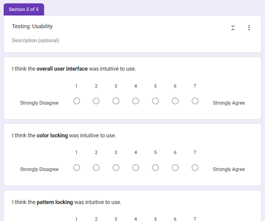

## Towards interactive evolutionary camouflage design

Rasmus Ploug, Emil Rimer, Anthon Petersen, [Marco Scirea](http://marcoscirea.com), Joseph Alexander Brown

<!--<small>[msc@mmmi.sdu.dk](mailto:msc@mmmi.sdu.dk) [gdlt.sdu.dk](https://gdlt.sdu.dk/)</small>-->

---

<!-- .slide: data-background-color="var(--color1)" -->
## Aesthetic Camouflage in Games

    
- Attributes to personalized player-characters
- Pre-made camouflages to ensure high quality skins
- Limits the amount of player choice

    
<!-- .element: style="width:70%" -->
<!-- .element: style="width:70%" -->

<!-- .slide: data-background-color="var(--color1)" -->
## The system

<small>    

- Utilizes an evolutionary algorithm.
- Employs different evolutionary principles.
- Increasing agency and personalization for players

</small>

    
<!-- .element: style="width:100%" -->

<!-- .slide: data-background="evo.png" data-background-size="contain" -->
<!-- .slide: data-background-color="var(--color1)" -->
## 

<!-- .slide: data-background-color="var(--color1)" -->
## 

    
<!-- .element: style="width:100%" -->
Pattern locking

    
<!-- .element: style="width:100%" -->
Primary color locking

---

<!-- .slide: data-background-color="var(--color2)" -->
# Pilot Study

Target-Replication Task & Questionnaire

<!-- .slide: data-background-color="var(--color2)" -->
## Target-Replication Task

<small>    
    
Test Setup: 
- 5 minutes of sandbox play with the tool to get the participant to learn to use it.
- Perform the target-replication task

Goal of the task: To replicate a randomly given camouflage pattern (to imitate the player recreating a skin seen in a game)

</small>

    
<!-- .element: style="width:100%" -->
<!-- .element: style="width:100%" -->

<!-- .slide: data-background-color="var(--color2)" -->
## Follow-up Questionnaire

    
The test was followed up by a questionnaire to assess the **usability** and **effectiveness** of the tool

    
<!-- .element: style="width:100%" -->

---

<!-- .slide: data-background-color="var(--color3)" -->
# Results

<!-- .slide: data-background-color="var(--color3)" -->
## Results from Target-Replication Task

Completion Time for **Target 1 (Simple)** was significantly higher than that for **Target 3 (Complex)**, with a p-value of 0.037

<!-- .slide: data-background-color="var(--color3)" -->
## Results from Target-Replication Task

<!-- .slide: data-background-color="var(--color3)" -->
### Results from the Follow-up Questionnaire

Participants show mixed reactions about their agency in the system...<!-- .element: class="fragment" -->

... but felt satisfied with the results!<!-- .element: class="fragment" -->

#  

---

<!-- .slide: data-background="logo_metaverse.png" data-background-size="contain" data-background-opacity="3%"  -->
<!-- .slide: data-background-color="var(--color4)" -->
## Thank you :)

Webpage: [marcoscirea.com](https://marcoscirea.com)

Metaverse Lab webpage: [gdlt.sdu.dk](https://gdlt.sdu.dk)

You can find this presentation at [marcoscirea.com/presentations/cog-camo](marcoscirea.com/presentations/cog-camo)

