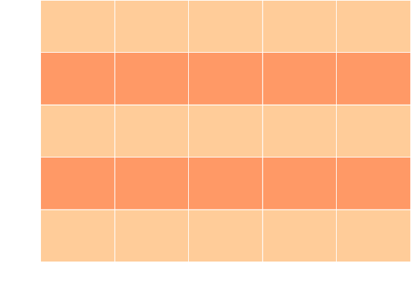

### Towards Diverse Non-Player Character behaviour discovery in multi-agent environments

Jan Kirk, [Marco Scirea](http://marcoscirea.com)

<!--<small>[msc@mmmi.sdu.dk](mailto:msc@mmmi.sdu.dk) [gdlt.sdu.dk](https://gdlt.sdu.dk/)</small>-->

---

<!-- .slide: data-background-color="var(--color1)" -->
## Non-Player characteres have a large impact on the player experience

Interactions with NPCs contributes to the feel of complexity of the game and "aliveness" of the world <!-- .element: class="fragment" -->

But creating varying complex behaviours is resource intensive, especially when the NPCs can interact with each other!<!-- .element: class="fragment" -->

<!-- .slide: data-background-color="var(--color1)" -->
## We propose a methodology to create diverse behaviours in a multi-agent environment using quality-diversity algorithms

<!-- .slide: data-background-color="var(--color1)" -->
#   

<!-- .slide: data-background-color="var(--color1)" -->
## Benchmark environment

Main entities: Agents, Gold, Weapons, Food

<!-- .slide: data-background-color="var(--color1)" -->
## Agent Behaviour Tree

The basic BT is tweaked through the quality-diversity algorithm (through 9 genes), changing priorities and thresholds to decide between different actions

<!-- .slide: data-background-color="var(--color1)" -->
## Methods

Hybrid Map-Elites algorithm -> Multiple agents play the simulation simultaneously<!-- .element: class="fragment" -->

Feature space: GroupTendency, SurvivalTime, TotalDamage<!-- .element: class="fragment" -->

---

<!-- .slide: data-background-color="var(--color2)" -->
## Results

We ran the system in two different configurations

<!-- .slide: data-background-color="var(--color2)" -->
## Generations 120, Sample size 20, 2400 itr
 
Discovered 159 elites...

<!-- .element: style="width:50%" -->

<!-- .slide: data-background-color="var(--color2)" -->
## Generations 120, Sample size 20, 2400 itr

- Agent TotalDamage (in turn survival & fitness(gold)), in the benchmark environment, seems too random
- Prediction was low (3.8%), due to high randomness

Note:
positive view: we find similarly performing individuals everywhere
negative view: the combat system is too random, not allowing us to distinguish between good/bad individuals

<!-- .slide: data-background-color="var(--color2)" -->
## Generations 100, Sample size 100, 10000 itr.

Less elites, but better distribution

<!-- .element: style="width:50%" -->

<!-- .slide: data-background-color="var(--color2)" -->
## Generations 100, Sample size 100, 10000 itr.
- Simulation time high, > 24 hours
- Prediction was decent (Multiple linear regression 40%), impact of randomness reduced due  to many iterations

---

<!-- .slide: data-background-color="var(--color3)" -->
## Conclusions

**Strengths:**
- The hybrid ME algorithm seems capable of isolating diverse well perfoming agents.
- The feature space can be adapted to evolve the desired agent aspects.

**Weaknesses:**
- The benchmark environment is too simple and included too much randomness
- The system is not optimized to reduce execution time.

---

<!-- .slide: data-background-color="var(--color4)" -->
## Thank you :)

Webpage: [marcoscirea.com](https://marcoscirea.com)

Metaverse Lab webpage: [gdlt.sdu.dk](https://gdlt.sdu.dk)

You can find this presentation at [marcoscirea.com/presentations/cog-diverse](marcoscirea.com/presentations/cog-diverse)

