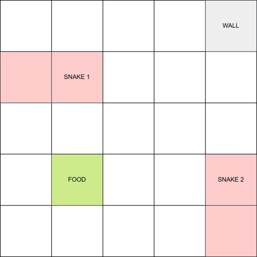
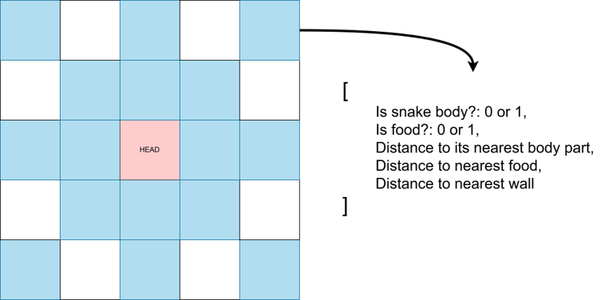
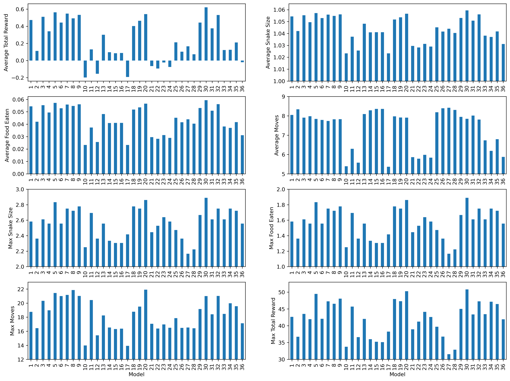

### Adaptive Agents in 1v1 Snake Game with Dynamic Environment

Hampus Fink Gärdström, Henrik Schwarz, [Marco Scirea](http://marcoscirea.com)

<!--<small>[msc@mmmi.sdu.dk](mailto:msc@mmmi.sdu.dk) [gdlt.sdu.dk](https://gdlt.sdu.dk/)</small>-->

---

<!-- .slide: data-background-color="var(--color1)" -->
## Adaptive Agents in Snake
- Motive<!-- .element: class="fragment" -->
  - Generalised learning<!-- .element: class="fragment" -->
  - Importance and influence of training environment in agents<!-- .element: class="fragment" -->
- Training PPO agents in different environments<!-- .element: class="fragment" -->
- Comparing performance of each agent in all other environments<!-- .element: class="fragment" --> 

<!-- .slide: data-background-color="var(--color1)" -->
## Snake Game

    
- 1v1 Snake game<!-- .element: class="fragment" -->
- Game continues till both die<!-- .element: class="fragment" -->
- Food and walls can spawn each round<!-- .element: class="fragment" -->

    
<!-- .element: style="width:70%" -->

<!-- .slide: data-background-color="var(--color1)" -->
## Agent structure

<small>    

- 16×5 Observation space
  - 8 Directions
  - 5 Properties
-Action space
- Reward structure
  - Food, +27
  - Approach food, +0.3
  - In-action, -0.3
  - Death, -29

</small>

    
<!-- .element: style="width:90%" -->

<!-- .slide: data-background-color="var(--color1)" -->
## Environment configuration

36 configurations

|     Parameter         |     Variables       |
|-----------------------|---------------------|
|     Map Size          |     5, 11, 19       |
|     Food Total Max    |     2, 10, 15       |
|     Walls Max         |     0, 2, 10, 15    |

<!-- .slide: data-background-color="var(--color1)" -->
## Model training

- Stable Baselines3 MlpPolicy
- Hyperparams:
  - Learning rate: 0.0003
  - n_steps: 32000
  - Batch size: 8000
- 25 million total time steps

<!-- .slide: data-background-color="var(--color1)" -->
## Evaluation

  

- Models against environments (36 × 36)<!-- .element: class="fragment" -->
- Play 500 games for each pair<!-- .element: class="fragment" -->

    
<!-- .element: style="width:90%" -->

<!-- .slide: data-background-color="var(--color1)" -->
## Results

Small map models perform better<!-- .element: class="fragment" -->

Max food and walls have little impact<!-- .element: class="fragment" -->

---

<!-- .slide: data-background="logo_metaverse.png" data-background-size="contain" data-background-opacity="3%"  -->
<!-- .slide: data-background-color="var(--color4)" -->
## Thank you :)

Webpage: [marcoscirea.com](https://marcoscirea.com)

Metaverse Lab webpage: [gdlt.sdu.dk](https://gdlt.sdu.dk)

You can find this presentation at [marcoscirea.com/presentations/cog-snake](marcoscirea.com/presentations/cog-snake)

