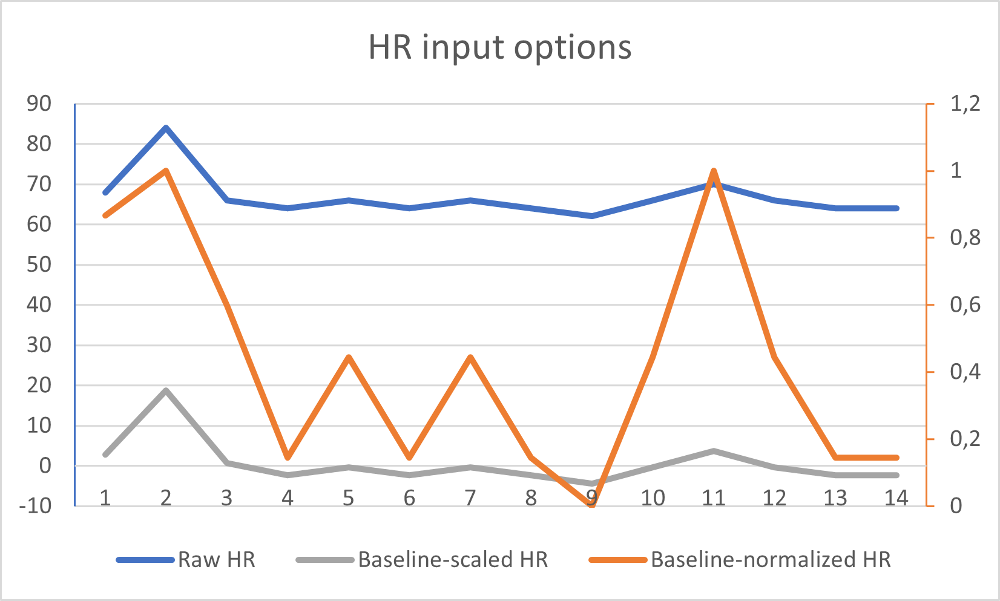

## Towards predicting social anxiety from biomarkers in a VR setup

[Marco Scirea](http://marcoscirea.com), Mathias Torp Ernst, Per Trads Ørskov
 
[msc@mmmi.sdu.dk](mailto:msc@mmmi.sdu.dk)

---

<!-- .slide: data-background-color="var(--color1)" -->
## Social anxiety disorder is a big issue

350.000 Danes are estimated to have an anxiety disorder<!-- .element: class="fragment" -->

Cognitive behavioral therapy (CBT) is considered the gold standard in the treatment of SAD and exposure is a central component to CBT<!-- .element: class="fragment" -->

Note:
Anxiety disorders are a very common mental health problem with an estimated lifetime prevalence between 13-21% (Somers et. al., 2006). Social anxiety disorder is one of the most prevalent anxiety disorder with prevalence between 4-14% (Chrome et al., 2015, Fehm et al., 2005, Ruscio et al 2018)

<!-- .slide: data-background-color="var(--color1)" -->
## What is exposure therapy?

<!-- .element: style="width:70%" class="fragment" -->

Note:
Exposure therapy is a psychological treatment that helps people confront their fears. The goal is to expose patients to the feared object or context without any risk in order to help them overcome their anxiety. 

<!-- .slide: data-background="VR8-extended2.png" data-background-size="contain" data-background-opacity="50%"  -->
<!-- .slide: data-background-color="var(--color1)" -->
## What about VR?<!-- .element: class="onFigure" --> 

Virtual Reality (VR) is a promising tool for exposure therapy.<!-- .element: class="fragment" -->

Immersive, controlled, and adaptable therapeutic environment.<!-- .element: class="fragment" -->

Easier to place the patient in anxiety inducing situations.<!-- .element: class="fragment" -->

Personalized, effective therapy experience.<!-- .element: class="fragment" -->

---
<small>Parsons et al. 2008, Opriş et al. 2013, Powers et al. 2008, Kampmann et al. 2016, Morina et al. 2021</small>

Note: 
Cognitive behavioral therapy (CBT) with exposure in VR has a superior effect compared to waitlist control, and similar effect when compared to CBT with in vivo exposure. Several meta-analyses on VR-exposure for SAD have been conducted (Parsons et al. 2008, Opriş et al. 2013, Powers et al. 2008, Kampmann et al. 2016, Morina et al, 2021)

<!-- .slide: data-background-color="var(--color1)" -->
## What about VR?

But it has some challenges:<!-- .element: class="fragment" -->
- How to build these virtual environments?<!-- .element: class="fragment" --> 
- How to adapt the experience to the specific patient?<!-- .element: class="fragment" -->
- How does it compare with traditional exposure therapy/in vivo?<!-- .element: class="fragment" -->
- <!-- .element: class="fragment" --><b>How to convey information about the patient's anxiety levels to the therapist during exposure?</b>

The proposed solution: Utilizing biomarkers for real-time monitoring of anxiety levels during VR sessions.<!-- .element: class="fragment" -->

<!-- .slide: data-background-color="var(--color1)" -->
## VRaid (VR8)

Project funded by Innovation Fund Denmark<!-- .element: class="fragment" -->

Development of a VR-content for individual tailored exposure therapy<!-- .element: class="fragment" -->

Development of a system to track anxiety levels<!-- .element: class="fragment" -->

<!-- .slide: data-background="exposure.png" data-background-size="contain"   -->
<!-- .slide: data-background-color="var(--color1)" -->
## <!-- .element: class="onFigure" -->

---

<!-- .slide: data-background="equipment.jpg" data-background-size="contain" -->
<!-- .slide: data-background-color="var(--color2)" -->
## Feasibility study<!-- .element: class="onFigure" -->

<!-- .slide: data-background-color="var(--color2)" -->
## Feasibility study

Testing of the high-fidelity prototype<!-- .element: class="fragment" data-fragment-index="1" -->

Secondary purpose of collecting HR, GSR, and Subjective Unitys of Distress (SUDS) data for predictive models.<!-- .element: class="fragment" -->

Demographics: 20 participants; 10 diagnosed with Social Anxiety Disorder (SAD) and 10 control participants.<!-- .element: class="fragment" -->

Note:
phasic GSR peaks

<!-- .slide: data-background-color="var(--color2)" -->
## Experiment setup

- Baseline in a "neutral" VR experience<!-- .element: class="fragment" -->
- Exposure to 4 scenarios<!-- .element: class="fragment" -->
- Participants asked to self-report SUDS every 2 minutes<!-- .element: class="fragment" -->

Note: SUDS 11 point Likert scale (0= not at all, 10= extremely).

<!-- .slide: data-background="Bench.jpg" data-background-size="contain"   -->
<!-- .slide: data-background-color="var(--color2)" -->
## ** **

<!-- .slide: data-background="Meeting.jpg" data-background-size="contain"   -->
<!-- .slide: data-background-color="var(--color2)" -->
## ** **

<!-- .slide: data-background="Presentation.png" data-background-size="contain"   -->
<!-- .slide: data-background-color="var(--color2)" -->
## ** **

<!-- .slide: data-background="Shopping.jpg" data-background-size="contain"   -->
<!-- .slide: data-background-color="var(--color2)" -->
## ** **

---

<!-- .slide: data-background-color="var(--color3)" -->
## Building a predictive model

<!-- .slide: data-background-color="var(--color3)" -->
## Machine Learning Models 

Three models applied: 
- Model 1: Linear Regression<!-- .element: class="fragment" -->
 - Widely used<!-- .element: class="fragment" -->
 - Assumes linar relationship between input/output<!-- .element: class="fragment" -->
 - Simple and interpretable (but limited)<!-- .element: class="fragment" -->

<!-- .element: style="width:25%" -->

<!-- .slide: data-background-color="var(--color3)" -->
## Machine Learning Models 

- Model 2: Backpropagation<!-- .element: class="fragment" -->
 - Classic algorithm for training artificial neural networks<!-- .element: class="fragment" -->
 - Able to learn complex, non-linear relationships<!-- .element: class="fragment" -->
 - Static network architecture<!-- .element: class="fragment" -->
- Model 3: NeuroEvolution of Augmented Topologies (NEAT)<!-- .element: class="fragment" -->
 - Evolutionary algorithm<!-- .element: class="fragment" -->
 - Also trains neural network<!-- .element: class="fragment" -->
 - Flexible network topology<!-- .element: class="fragment" -->

<!-- .slide: data-background-color="var(--color3)" -->
## Data Treatment

Based on the collected data, we considered three data scenarios as inputs of the models: <!-- .element: class="fragment" -->
1. Raw HR and GSR peaks per minute data<!-- .element: class="fragment" -->
2. Baseline-normalized (avg ± 1 SD)<!-- .element: class="fragment" -->
3. Baseline-scaled data <!-- .element: class="fragment" -->

<!-- .slide: data-background-color="var(--color3)" -->
## Data Treatment

<!-- .slide: data-background-color="var(--color3)" -->
## Model output

Two model output options: <!-- .element: class="fragment" -->
 - Estimated SUDS (continuous scale) <!-- .element: class="fragment" -->
 - Brackets of SUDS (categorical scale)<!-- .element: class="fragment" -->

<!-- .slide: data-background-color="var(--color3)" -->
## Comparative Results

- Linear regression method gives precision between 56% and 68% <!-- .element: class="fragment" -->
- Backpropagation setups give disappointing precision around 50%<!-- .element: class="fragment" -->
- The best two models are found with NEAT using raw data <!-- .element: class="fragment" -->

Note: After training and testing our models, we found some fascinating results. Of the three methods, NEAT proved to be the most precise, with the ability to estimate SUDS scores with a precision rate of 78% and classify them into SUDS brackets with 73% precision. In contrast, the precision of Linear Regression and Backpropagation was between 50% and 68%.

<!-- .slide: data-background-color="var(--color3)" -->
## Results for NEAT

|Input type\Output type|Suds normalised|suds bracketed|
|:----|:----|:----|
|Raw input|**0,78**|**0,73**|
|Baseline|0,63|0,60|
|Bracketed baseline|0,63|0,65|

<!-- .element: class="fragment" -->Unexpected result: an investigation of the best models shows **prioritization of HR over GSR** as a significant anxiety predictor. Moreover, **baseline data did not improve the model**

<!-- .slide: data-background-color="var(--color3)" -->
## Limitations

- Challenges in distinguishing between medium and high anxiety states due to limited biomarker options.<!-- .element: class="fragment" -->
- Potential bias from a relatively small dataset.<!-- .element: class="fragment" -->

---

<!-- .slide: data-background-color="var(--color4)" -->
## Conclusions

<!-- .slide: data-background-color="var(--color4)" -->
## Implications and Future Research

- One of the models is being used in an ongoing Randomized Control Trial (RCT)<!-- .element: class="fragment" data-fragment-index="1"-->
- We will evaluate its predictions once the RCT is done<!-- .element: class="fragment" -->
- ...while at the same time gathering more data to build better prediction models.<!-- .element: class="fragment" -->

---
<small>Ørskov, Per Trads, et al. "Cognitive behavioral therapy with adaptive virtual reality exposure vs. cognitive behavioral therapy with in vivo exposure in the treatment of social anxiety disorder: A study protocol for a randomized controlled trial." Frontiers in Psychiatry</small><!-- .element: class="fragment" data-fragment-index="1" -->

<!-- .slide: data-background-color="var(--color4)" -->
## Implications and Future Research

- We are also planning an experiment to build a large dataset of biometric data and SUDS from non-SAD participants

<!-- .slide: data-background="exposure.png" data-background-size="contain" data-background-opacity="20%"  -->
<!-- .slide: data-background-color="var(--color4)" -->
## Conclusion

Building advanced models to better predict and respond to anxiety levels could enhance the effectiveness of exposure therapy<!-- .element: class="fragment" -->

We are confident there's more advancements to be made <!-- .element: class="fragment" -->

The potential of adaptive VR: real-time prediction of anxiety can lead to personalized therapy sessions to insure not too easy/challenging exposure for the individual patient<!-- .element: class="fragment" -->

Note:
The intersection of VR and therapy is rich with potential. Our ability to predict anxiety levels in real time during VR exposure could greatly enhance the effectiveness of exposure therapy. With advances in machine learning and our understanding of biometrics, we're confident that this research field will continue to grow and improve patient outcomes.

<!-- .slide: data-background-color="var(--color4)" -->
## Thank you :)
---
Webpage: [marcoscirea.com](http://marcoscirea.com)

You can find this presentation at [marcoscirea.com/presentations/cypsy](http://marcoscirea.com/presentations/cypsy)

