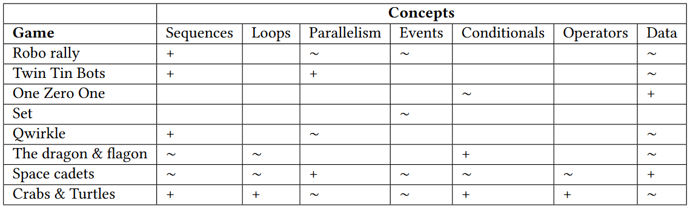
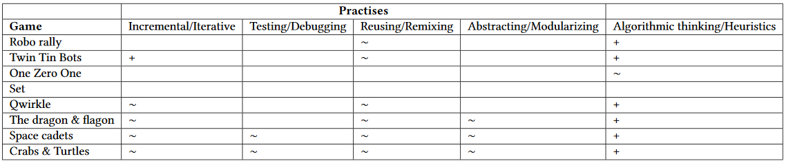
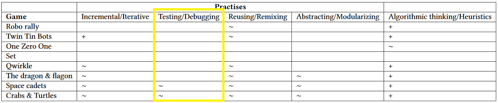
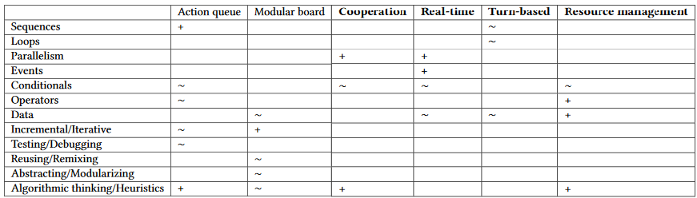

## Boardgames and Computational Thinking

*how to identify games with potential to support CT in the classroom*

[Marco Scirea](http://marcoscirea.com) and Andrea Valente

SDU Game Development and Learning Technology

---

<!-- .slide: data-background="programming.jpg" data-background-opacity="50%" -->
### <!-- .element: class="onFigure" -->Programming is becoming an ever important skill

### Computational thinking

Being able to express problems and solutions in ways that a computer could execute<!-- .element: class="fragment" -->

Becoming more and more important at a strategic level as a discipline to teach young pupils<!-- .element: class="fragment" -->

### How is it currently taught?

Many<!-- .element: class="fragment" --> ways: from more classic lectures/exercises to more "fun" games and puzzles (playful learning) <!-- .element: class="fragment" -->

<!-- .slide: data-background="puzzle.jpg" data-background-opacity="50%" -->
### The problem with the "fun" approaches

There is usually only a static set of challenges<!-- .element: class="fragment" -->

Students are not the same!<!-- .element: class="fragment" -->

Usually single-use, how can we make more? <!-- .element: class="fragment" -->

Sadly the current answer is teachers :(<!-- .element: class="fragment" -->

### The goal

By identifying and analysing CT-relevant commercial boardgames we hope to:
* Give teachers a larger pool of easily accessible games to include in the curriculum<!-- .element: class="fragment" -->
* Provide students with a more well-designed game experience<!-- .element: class="fragment" -->
* Allow us to discover which game mechanics are related to CT topics<!-- .element: class="fragment" -->

### Examples of analog games for teaching CT

<!-- .slide: data-background="sorting.png" data-background-size="contain" -->
### <!-- .element: class="onFigure" -->CS-Unplugged

<!-- .slide: data-background-video="https://thcf8.redgifs.com/FlickeringForcefulItaliangreyhound.mp4" data-background-opacity="50%" -->
### Turing Tumble

[https://www.turingtumble.com/](https://www.turingtumble.com/)

### Computer games

<!-- .slide: data-background="screen_basic.png"" data-background-opacity="50%" -->
### LightBot

[https://lightbot.com/](https://lightbot.com/)

<!-- .slide: data-background="robocode.png"" data-background-opacity="50%" -->
### Robocode

[https://robocode.sourceforge.io/](https://robocode.sourceforge.io/)

<!-- .slide: data-background="karel2.png"" data-background-opacity="50%" -->
### Karel

[https://nclab.com/create-your-own-karel-coding-game/](https://nclab.com/create-your-own-karel-coding-game/)

<!-- .slide: data-background="shenzen.jpg"" data-background-opacity="75%" -->
### Programming Games

For example [Shenzen I/O](https://store.steampowered.com/app/504210/SHENZHEN_IO/)

---

### Boardgame analysis

We chose 6 commercial games that we thought appeared related to CT concepts, while being generally quite different games in both gameplay and setting.<!-- .element: class="fragment" -->

We also include an additional game developed explicitly for teaching CT conceps.<!-- .element: class="fragment" -->

<!-- .slide: data-background="RoboRally1.jpg"  -->
### <!-- .element: class="onFigure" -->Robo rally

<!-- .slide: data-background="RoboRally2.jpg"-->
###  

<!-- .slide: data-background="twin-tin-bots.png"-->
### <!-- .element: class="onFigure" -->Twin tin bots

<!-- .slide: data-background="ozo.jpg"-->
### <!-- .element: class="onFigure" -->One Zero One

<!-- .slide: data-background="set1.jpg"-->
### <!-- .element: class="onFigure" -->SET

<!-- .slide: data-background="set2.png" -->
###  

<!-- .slide: data-background="qwirkle.jpg" -->
### <!-- .element: class="onFigure" -->Qwirkle

<!-- .slide: data-background="space1.jpg"-->
### <!-- .element: class="onFigure" -->Space Cadets

<!-- .slide: data-background="space2.png"-->
###  

<!-- .slide: data-background="crabs.png"-->
### <!-- .element: class="onFigure" -->Crabs and Turtles

---

### Results

<!-- .slide: data-transition="fade-out"-->
### Results

<!-- .slide: data-transition="fade"-->
### Results

### Missing concepts

* Testing and debugging is rarely present<!-- .element: class="fragment" -->
* Loops<!-- .element: class="fragment" -->

### Results

<table class="tg">
<thead>
  <tr><!-- .element: class="fragment" -->
    <th class="tg-0pky">RoboRally</th>
    <th class="tg-0pky">
Action Queue 
Bias 
Grid Movement 
Lose a Turn 
Modular Board 
Programmed Movement 
Race 
Scenario / Mission / Campaign Game 
Simultaneous Action Selection </th>
  </tr>
</thead>
</table>

<small>from boardgamegeek.com</small><!-- .element: class="fragment" -->

### Supportive mechanics

### How to identify CT-relevant games

Ideally choose a game that contains some of these features: action queues, cooperation between the players, resource management, modular pieces, and a hybrid turn-based/real-time game progression<!-- .element: class="fragment" -->

To<!-- .element: class="fragment" --> compensate for the difficulty of covering (or even supporting) the testing/debugging practice, this "optimal" game can be presented to the learners in the class as an iterative activity of *design for others to play*.

---

### Conclusions

This is an initial analysis of how to identify boardgames to support CT<!-- .element: class="fragment" -->

Obviously there is a need to analyse a larger corpus, with more varied game mechanics<!-- .element: class="fragment" -->

Importantly,<!-- .element: class="fragment" --> the highlighted mechanics can be, *but are not necessarily*, supportive of CT!

## Thank you :)
---

Mail: [msc@mmmi.sdu.dk](msc@mmmi.sdu.dk) and [anva@mmmi.sdu.dk](anva@mmmi.sdu.dk)

Twitter: [@MarcoScirea](https://twitter.com/MarcoScirea)

You can find this presentation at [marcoscirea.com/presentations/fdg20](http://marcoscirea.com/presentations/fdg20)
