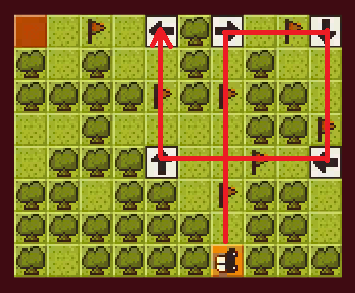

## Adaptive puzzle generation for Computational Thinking

[Marco Scirea](http://marcoscirea.com)
 
[msc@mmmi.sdu.dk](msc@mmmi.sdu.dk)

---

<!-- .slide: data-background="programming.jpg" data-background-opacity="50%" -->
### <!-- .element: class="onFigure" -->Programming is becoming an ever important skill

### Computational thinking

Being able to express problems and solutions in ways that a computer could execute<!-- .element: class="fragment" -->

Becoming more and more important at a strategic level as a discipline to teach young pupils<!-- .element: class="fragment" -->

### How is it currently taught?

Many<!-- .element: class="fragment" --> ways: from more classic lectures/exercises to more "fun" games and **puzzles** <!-- .element: class="fragment" -->

<!-- .slide: data-background="puzzle.jpg" data-background-opacity="50%" -->
### The problem with puzzles

There is usually only a static set of challenges<!-- .element: class="fragment" -->

Students are not the same!<!-- .element: class="fragment" -->

Usually one-use, how can we make more? <!-- .element: class="fragment" -->

Sadly the current answer is teachers :(<!-- .element: class="fragment" -->

### The goal

By having a system that creates adaptive challenges we can 
* Alleviate the burden of exercise creation from the teachers<!-- .element: class="fragment" -->
* Create more tailored content to the students<!-- .element: class="fragment" -->
* Allow students to proceed at their own pace<!-- .element: class="fragment" -->

<!-- .slide: data-background="minecraft.jpg" -->
### <!-- .element: class="onFigure" -->Procedural content generation

The creation of some kind of content through algorithms<!-- .element: class="fragment" -->

Becoming increasingly common in commercial games as well<!-- .element: class="fragment" -->

### Evolutionary computation

A family of optimization algorithms inspired by biological evolution<!-- .element: class="fragment" -->

We use a combination of 2 algorithms:  FI-2Pop and NSGA-II<!-- .element: class="fragment" -->

In short: we can optimize for different objectives (NSGA-II) and constraints (FI-2Pop) at the same time <!-- .element: class="fragment" -->

---

<!-- .slide: data-background="car1.png" data-background-size="contain" -->
### <!-- .element: class="onFigure" -->The puzzle

<!-- .slide: data-background="car2.png" data-background-size="contain" -->
###  

### What CT concepts are explored?

* Sequences<!-- .element: class="fragment" -->
* Being incremental and iterative<!-- .element: class="fragment" -->
* Debugging and testing<!-- .element: class="fragment" -->

### How does a solution look like?

{Up, Right, Down, Left, Up, Left}

---
<small>Not really a playable level by itself</small>

### Constraints

* No opposite directions one after the other<!-- .element: class="fragment" -->
* No same direction consecutively<!-- .element: class="fragment" -->

### Objectives

* Target lenght<!-- .element: class="fragment" -->
* Loops<!-- .element: class="fragment" -->

### Semi-stochastic translation to playable level

This means that same solution can create slightly different (but equivalent) puzzles<!-- .element: class="fragment" -->

<small>Details of the algorithm in paper</small>

---

### How can we make it adapt to the player?

We have a simple player model that based on observations of how the player performs adjusts the algorithm targets (lenght and loop number)<!-- .element: class="fragment" -->

<!-- .slide: data-background="progression1.png" data-background-size="contain" -->
### <!-- .element: class="onFigure" --> 

<!-- .slide: data-background="progression2.png" data-background-size="contain" -->
### <!-- .element: class="onFigure" --> 

<!-- .slide: data-background="progression3.png" data-background-size="contain" -->
### <!-- .element: class="onFigure" --> 

<!-- .slide: data-background="progression4.png" data-background-size="contain" -->
### <!-- .element: class="onFigure" --> 

<!-- .slide: data-background="progression5.png" data-background-size="contain" -->
### <!-- .element: class="onFigure" --> 

---

### Results

### Results

### <!-- .element: class="onFigure" -->Can we make really hard puzzles?

<!-- .slide: data-background="verylarge2.png" data-background-size="contain" -->
### <!-- .element: class="onFigure" --> 

---

### Extension of the work

### Conclusions

While still in an early stage, this system shows how PCG coupled with player modelling could be useful in creating adaptive (and hopefully fun) challenges to teach students computational thinking concepts

## Thank you :)
---
Webpage: [marcoscirea.com](http://marcoscirea.com)

Twitter: [@MarcoScirea](https://twitter.com/MarcoScirea)
